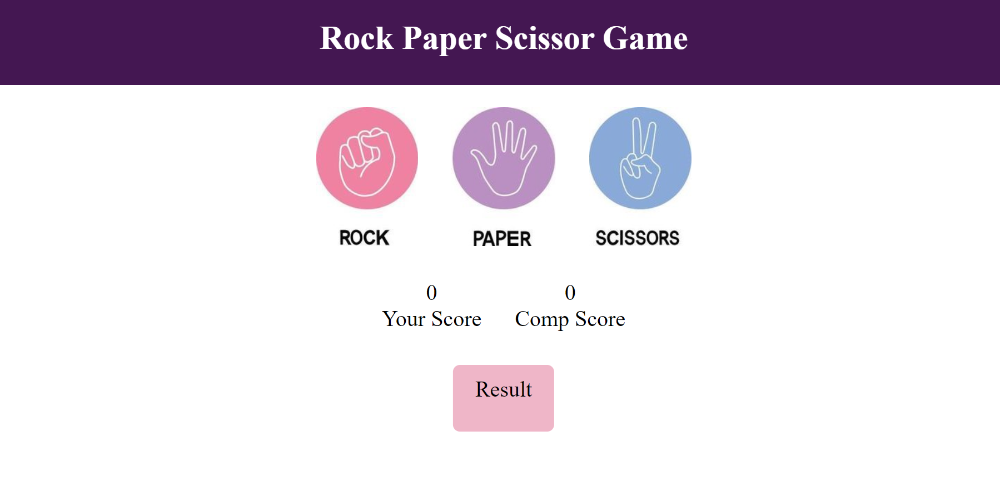

# 🎮 Rock Paper Scissors Game  

A fun and interactive **Rock-Paper-Scissors** game built using **HTML, CSS, and JavaScript**. Play against the computer and test your luck!  

---

## 🚀 Live Demo  
🔗 [Play the Game](https://rambabupalla.github.io/Rock-Paper-Scissors-Game/)  

---

## 🖼️ Preview  
  

---

## 📌 Features  
✅ Simple and clean UI 🎨  
✅ Randomized computer choices 🤖  
✅ Score tracking 📊  
✅ Responsive design for mobile & desktop 📱  

---

## 🎯 How to Play  
1️⃣ Click on **Rock 🪨, Paper 📄, or Scissors ✂️** to make your move.  
2️⃣ The computer will randomly pick one too.  
3️⃣ The winner is decided based on these rules:  
   - **Rock beats Scissors** 🪨✂️  
   - **Scissors beats Paper** ✂️📄  
   - **Paper beats Rock** 📄🪨  
4️⃣ The game will update the score automatically.  

---

## 🛠️ Technologies Used  
- **HTML** → Structure of the game 🎭  
- **CSS** → Styling & animations 🎨  
- **JavaScript** → Game logic & interactivity 🎮  

---

## 📝 Installation  
1️⃣ **Clone the repository**  
   ```sh
   git clone https://github.com/rambabupalla/Rock-Paper-Scissors-Game.git
